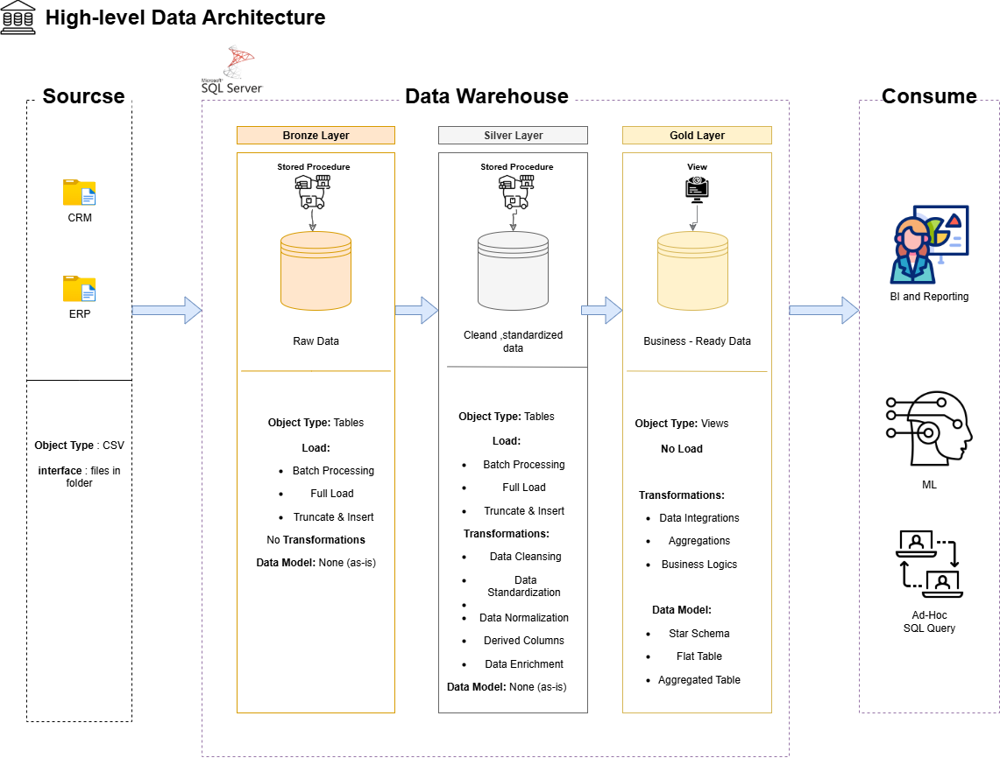
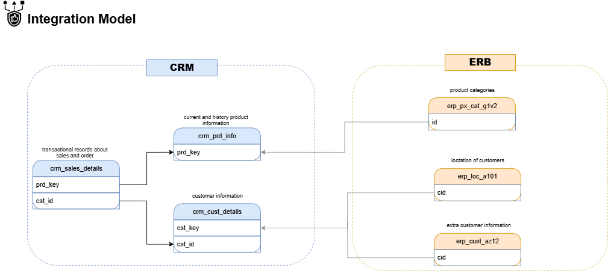
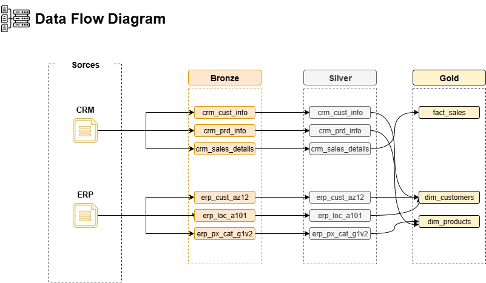

# Sales Data Warehouse

A full end-to-end data warehouse project built on **Microsoft SQL Server** using the **Medallion Architecture** (Bronze → Silver → Gold). Data is sourced from two operational systems — a CRM and an ERP — and transformed into a clean Star Schema ready for reporting and analytics.

---

## Table of Contents

- [Project Overview](#project-overview)
- [Architecture](#architecture)
- [Repository Structure](#repository-structure)
- [Data Sources](#data-sources)
- [Layers](#layers)
  - [Bronze](#bronze-layer)
  - [Silver](#silver-layer)
  - [Gold](#gold-layer)
- [Star Schema](#star-schema)
- [How to Run](#how-to-run)
- [Data Quality](#data-quality)

---

## Project Overview

| Property        | Detail                              |
|----------------|-------------------------------------|
| Database        | Microsoft SQL Server                |
| Architecture    | Medallion (Bronze / Silver / Gold)  |
| Gold Pattern    | Star Schema                         |
| Source Systems  | CRM (6 columns) + ERP (3 files)     |
| Fact Rows       | 60,398 sales transactions           |
| Customers       | 18,484                              |
| Products        | 197 active / 397 total versions     |

---

## Architecture

### High-Level Data Architecture

> 📌 **Figure 1 – High-Level Data Architecture**
>
> 
>
> *End-to-end view of the warehouse layers — from raw source files to Gold analytics views.*

---

### Integration Model

> 📌 **Figure 2 – Integration Model**
>
> 
>
> *How the six Silver tables relate to each other and which keys connect CRM and ERP sources.*

---

### Data Flow

> 📌 **Figure 3 – Data Flow**
>
> 
>
> *Step-by-step movement of data from source files through Bronze → Silver → Gold → Reporting.*

---

## Repository Structure

```
sales-data-warehouse/
│
├── datasets/                         # Raw source files
│   ├── crm/
│   │   ├── cust_info.csv
│   │   ├── prd_info.csv
│   │   └── sales_details.csv
│   └── erp/
│       ├── CUST_AZ12.csv
│       ├── LOC_A101.csv
│       └── PX_CAT_G1V2.csv
│
├── scripts/
│   ├── bronze/
│   │   └── bronze_stored_procedures.sql    # Bronze load SPs
│   │
│   ├── silver/
│   │   ├── silver_ddl.sql                  # CREATE TABLE statements
│   │   └── silver_stored_procedures.sql    # Single SP: silver.load_silver
│   │
│   └── gold/
│       ├── gold_dim_customers.sql          # View: gold.dim_customers
│       ├── gold_dim_products.sql           # View: gold.dim_products
│       └── gold_fact_sales.sql             # View: gold.fact_sales
│
├── tests/
│   ├── silver_quality_checks.sql           # Silver layer quality checks
│   └── gold_quality_checks.sql             # Gold layer quality checks
│
├── docs/
│   ├── data_catalog.md                     # Full column-level documentation
│   └── figures/
│       ├── 01_high_level_architecture.png  # Figure 1
│       ├── 02_integration_model.png        # Figure 2
│       └── 03_data_flow.png                # Figure 3
│
└── README.md
```

---

## Data Sources

### CRM System  *(lowercase filenames)*

| File               | Description              | Rows   |
|-------------------|--------------------------|--------|
| `cust_info.csv`   | Customer master records  | 18,494 |
| `prd_info.csv`    | Product catalogue        | 397    |
| `sales_details.csv`| Sales transactions      | 60,398 |

### ERP System  *(UPPERCASE filenames)*

| File              | Description              | Rows   |
|------------------|--------------------------|--------|
| `CUST_AZ12.csv`  | Customer demographics    | 18,484 |
| `LOC_A101.csv`   | Customer locations       | 18,484 |
| `PX_CAT_G1V2.csv`| Product categories       | 37     |

---

## Layers

### Bronze Layer

Raw data loaded directly from source files with **no transformations**. Preserves original values for full auditability and reprocessing.

- One table per source file
- All columns stored as their original types
- Loaded via stored procedures in `scripts/bronze/`

---

### Silver Layer

Cleaned, standardised, and integrated data. All issues found in the Bronze layer are corrected here.

Key transformations per table:

| Table                        | Key Transformations                                                                 |
|-----------------------------|--------------------------------------------------------------------------------------|
| `silver.crm_prd_info`       | Derive `prd_sub_key` + `cat_id`; fill NULL cost; expand line codes; derive `prd_end_dt` via LEAD |
| `silver.crm_cust_info`      | Drop NULL `cst_id`; deduplicate on `cst_key` (keep latest); expand M/F/S codes; trim whitespace |
| `silver.crm_sales_details`  | INT→DATE conversion; fix negative prices; recalculate inconsistent `sales_amount`   |
| `silver.erp_px_cat_g1v2`    | Trim whitespace; convert Yes/No→BIT                                                  |
| `silver.erp_loc_a101`       | Normalise CID format; standardise country abbreviations; NULL→Unknown               |
| `silver.erp_cust_az12`      | Strip NAS prefix from CID; nullify future birthdates; standardise gender values      |

**Run the Silver layer:**
```sql
EXEC silver.load_silver;
```

---

### Gold Layer

Business-ready views built on top of Silver. No physical data — always reflects the latest Silver state. Structured as a **Star Schema**.

| View                   | Type      | Rows   | Description                              |
|-----------------------|-----------|--------|------------------------------------------|
| `gold.dim_customers`  | Dimension | 18,484 | Unified customer profile                 |
| `gold.dim_products`   | Dimension | 197    | Active product catalogue with categories |
| `gold.fact_sales`     | Fact      | 60,398 | One row per sales order line             |

---

## Star Schema

```
                    ┌──────────────────────┐
                    │    dim_customers      │
                    │──────────────────────│
                    │ customer_key  (PK)    │
                    │ customer_id           │
                    │ customer_number       │
                    │ first_name            │
                    │ last_name             │
                    │ gender                │
                    │ birth_date            │
                    │ marital_status        │
                    │ country               │
                    │ customer_create_date  │
                    └──────────┬───────────┘
                               │ 1
                               │
                               │ N
          ┌────────────────────┴────────────────────┐
          │              fact_sales                  │
          │──────────────────────────────────────────│
          │ customer_key   (FK → dim_customers)       │
          │ product_key    (FK → dim_products)        │
          │ order_number                              │
          │ order_date                                │
          │ ship_date                                 │
          │ due_date                                  │
          │ sales_amount                              │
          │ quantity                                  │
          │ unit_price                                │
          └──────────────────┬──────────────────────┘
                             │ N
                             │
                             │ 1
                    ┌────────┴─────────────┐
                    │    dim_products       │
                    │──────────────────────│
                    │ product_key   (PK)    │
                    │ product_id            │
                    │ product_number        │
                    │ product_name          │
                    │ product_cost          │
                    │ product_line          │
                    │ start_date            │
                    │ category              │
                    │ subcategory           │
                    │ maintenance_required  │
                    └──────────────────────┘
```

---

## How to Run

Run scripts in the following order:

```sql
-- Step 1: Create Bronze tables and load raw data
EXEC bronze.load_bronze;

-- Step 2: Create Silver tables (DDL)
-- Run: scripts/silver/silver_ddl.sql

-- Step 3: Clean and load Silver
EXEC silver.load_silver;

-- Step 4: Create Gold views
-- Run: scripts/gold/gold_dim_customers.sql
-- Run: scripts/gold/gold_dim_products.sql
-- Run: scripts/gold/gold_fact_sales.sql      ← run last (depends on both dims)
```

---

## Data Quality

Quality check scripts are provided for both Silver and Gold layers.

```sql
-- Validate Silver after load
-- Run: tests/silver_quality_checks.sql

-- Validate Gold after Silver refresh
-- Run: tests/gold_quality_checks.sql
```

Checks include:

- NULL validation on key columns
- Duplicate detection on unique/PK columns
- Domain validation (gender, marital status, country)
- Date logic (order before ship, end after start)
- Referential integrity (every FK resolves to a dimension row)
- Measure consistency (sales = quantity × price)

---

## Documentation

Full column-level documentation for all layers is available in(docs/data-catalog.md).
